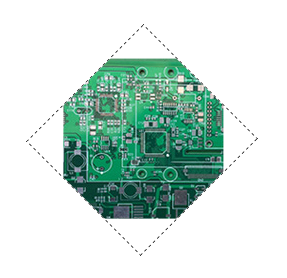
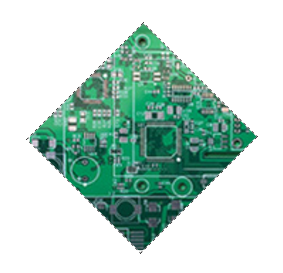
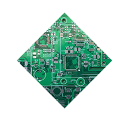
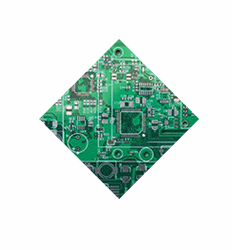

# 第十二章、菱形图片

## 基于变形的方案
对容器进行变形，再对图片进行反向变形。
```css
<div id="a">
    
</div>

#a{
    margin: 300px  auto;
    border: 1px dashed #333;
    width: 160px;
    overflow: hidden;
    transform:rotate(45deg);
}
#a>img{
    max-width: 100%;
    transform:rotate(-45deg);
}
```
<div align=center></div>  

上下左右会有空白，是因为图片的宽度为100%，会等于容器的宽度，变为菱形后图片的宽度应为容器对角线的长度。勾股定理求得约等于142%(向上取整，向下取整还是会出现空白，向上取整才会超出)。使用scale()进行放大。
```css
#a>img{
    max-width: 100%;
    transform:rotate(-45deg) scale(1.42);
}
```
<div align=center></div>  

## 使用clip-path方案（此属性浏览器支持程度不高）
clip-path允许我们制定一个剪裁路径，将元素剪裁成我们需要的样子，理论上可以剪裁成任何形状。
```css
img{
    clip-path: polygon(50% 0,100% 50%,50% 100%,0 50%);
}
```
<div align=center></div>  

clip-path属性还支持渐变动画
```css
img{
    clip-path: polygon(50% 0,100% 50%,50% 100%,0 50%);
    transition: .5s clip-path;
}
img:hover{
    clip-path: polygon(0 0,100% 0,100% 100%,0 100%);
}
```
<div align=center></div>  
