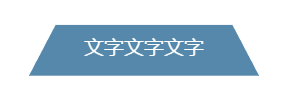
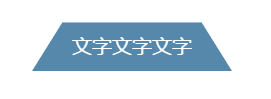
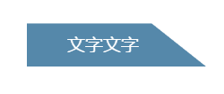
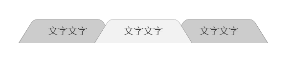

# 第十四章、切脚效果
让一个矩形在3D上进行X轴旋转，由于3D透视的关系，看上去就会变成一个梯形，所以可以利用之前平行四边形的解决方案来实现梯形，因为3D变形无法通过内部元素的反向变形来达到抵消的效果，所以不能使用嵌套元素解决方案，只能使用伪元素解决方案。
```css
#a:after{
    transform: perspective(.5em) rotateX(3deg);
}
```
<div align=center></div>  

由于没有设置transform-origin属性，应用变形的伪元素会以他自身的中心线为轴进行旋转，这样看上去，整个元素的宽度就增加了，并且位置会稍微下移，高度会有少量缩减。
将伪元素的轴线设置为底边可以解决前两个问题。
```css
transform-origin: bottom;
```
<div align=center></div>  

为了弥补元素在高度上的缩减，可以对伪元素的高进行放大，具体放大的数值可以根据旋转的角度进行微调。
```css
transform:scaleY(1.4) perspective(.5em) rotateX(5deg);
```
<div align=center></div>  

这个技巧的最大优点在于CSS样式非常灵活，可以给伪元素添加背景，边框，圆角，投影等等属性。并且只要把transform-origin属性的值改为 bottom left或bottom right，就可以生成左边或右边的直角梯形（注意对左右内边距进行补正，让文字在视觉效果上保持居中）。
```css
#a{
    box-sizing: border-box; // 保证增加内边距时盒子总大小不变
    padding-right: 30px;
}
#a:after{
    transform:scaleY(1.4) perspective(.5em) rotateX(5deg);
    transform-origin: bottom left;
}
```
<div align=center></div>  

这一技巧可以很容易实现梯形样式的标签。
<div align=center></div>  


