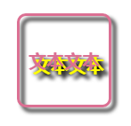

# 第十七章、不规则投影
box-shadow只能对盒子本身进行投影，无法对不规则的图形进行投影，例如对话气泡，三角形的小尾巴通常是用伪元素生成的，对主元素使用投影，伪元素无法得到投影效果。
<div align=center></div>  

解决方案是使用filter属性，此属性浏览器支持程度不高。filter属性中的drop-shadow函数可以实现投影，语法与box-shadow类似。
```css
filter:drop-shadow(2px 2px 4px rgba(0,0,0,0.9));
```
<div align=center></div>  

此属性的drop-shadow函数会给任何非透明的部分打上投影，包括文本（当背景透明时），并且无法用text-shadow：none;清除。当已经设置了text-shadow属性时，文本的投影也会被drop-shadow函数打上投影，造成双投影的结果。
```css
text-shadow: 5px 5px yellow;
filter: drop-shadow(5px 5px 2px black);
```
<div align=center></div>  
