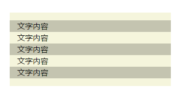

# 第二十二章、文本行的斑马条纹
利用渐变背景可以实现多行文本之间的斑马线。
```css
padding:1em;
line-height: 1.5;
background-color: beige; 
background-origin: content-box;  // 通常文本不会从盒子顶部开始，盒子一般会有内边距，所以将背景定义为对齐到内容盒子。
background-image: linear-gradient(rgba(0,0,0,.2) 50%,transparent 0);
background-size: 100% 3em;  // 渐变背景的高度大小为行高的2倍，这样就能实现间隔条纹的斑马线对齐文本。
```
<div align=center></div>  

