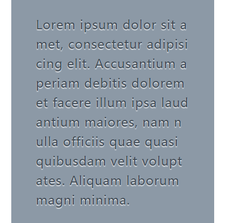
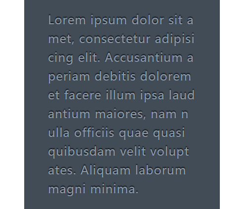
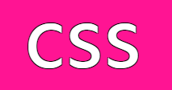
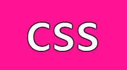
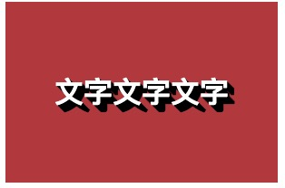

# 第二十四章、现实中的文字效果
## 凸版印刷效果
当文字为浅色背景配上深色文字时，在文字的底部加上浅色投影效果最佳。
```css
background: hsl(210,13%,60%);
color: hsl(210,13%,30%);
text-shadow: 0 .07em .07em rgba(255,255,255,.8);  // 这个例子中文字底部的白色阴影使得文字有立体感
```
<div align=center></div>  

当文字为深色背景配上浅色文字时，在文字的顶部加上深色投影效果最佳。
```
background: hsl(210,13%,30%);
color: hsl(210,13%,60%);
text-shadow: 0 -.07em .07em rgba(0,0,0,.8);  // 这个例子中文字顶部的黑色阴影使得文字有立体感
```
<div align=center></div>  

## 空心字效果
利用text-shadow叠加的效果来给文字实现描边效果。

通过各个方向想偏移量相同的阴影叠加形成描边
```css
text-shadow: 1px 1px black, -1px -1px black,
             1px -1px black, -1px 1px black;
```
<div align=center></div>  


通过多层相同的模糊阴影叠加形成描边
```css
text-shadow: 0 0 3px black,
             0 0 3px black,
             0 0 3px black,
             0 0 3px black,
             0 0 3px black,
             0 0 3px black,
             0 0 3px black,
             0 0 3px black,
             0 0 3px black,
             0 0 3px black;
```
<div align=center></div>  

## 文字外发光效果
文字的阴影跟文字颜色一样的情况下可以实现文字的发光效果。
```css
.a {
  background: #203;
  color: #ffc;
  transition: 1s;
}
.a:hover {
  text-shadow: 0 0 0.1em, 0 0 0.3em; // 不指定颜色即为与文字颜色一样
}
```
点击查看[demo](https://codesandbox.io/s/nostalgic-germain-39wlx)  

将文字颜色变为透明，并将阴影颜色设置为文字颜色，可以利用阴影实现文字模糊效果
```css
.a {
  background: #203;
  color: white;
  transition: 1s;
}
.a:hover {
  color: transparent;
  text-shadow: 0 0 0.1em white, 0 0 0.3em white;
}
```
点击查看[demo](https://codesandbox.io/s/keen-sinoussi-7fj7m)
## 文字凸起效果
利用文字的多层阴影叠加，并在最底部增加一层深色的阴影，可以实现文字的凸起（伪3D）效果。
```css
.a {
  background: #58a;
  color: white;
  text-shadow: 0 1px hsl(0,0%,85%),
               0 2px hsl(0,0%,80%),
               0 3px hsl(0,0%,75%),
               0 4px hsl(0,0%,70%),
               0 5px hsl(0,0%,65%),
               0 5px 10px black;  // 最后一层深色阴影扩散10px
}
```
<div align=center></div>  

多层相同阴影叠加可以实现复古标志牌文字。
```css
.a {
  background: hsl(0,50%,45%);
  color: white;
  text-shadow: 1px 1px black,
               2px 2px black,
               3px 3px black,
               4px 4px black,
               5px 5px black,
               6px 6px black,
               7px 7px black,
               8px 8px black;
}
```
<div align=center></div>  
