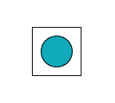
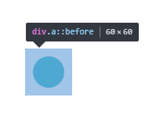

# 第二十六章、扩大可点击区域
可点击区域想歪扩张往往可以带来可用性的提升。
```css
.a{
    border: 10px solid transparent; // 添加10px的透明边框，让元素比实际看上去的大10px
    background-clip: padding-box; // 背景会延伸到透明边框下，指定背景限制在原本的区域内
    box-shadow: 0 0 0 1px rgba(0,0,0,1) inset; // 因为占用了边框模拟点击区域，所以使用阴影模拟边框
}
```
最外边框为元素的实际大小：
<div align=center></div>  

这种方法的局限性在于需要绘制外部投影时，会变得怪异，因为外部投影都是绘制在边框之外的。可以利用伪元素解决这一问题。
```css
.a:before{
    content: "";
    position: absolute;
    top: -10px;
    left: -10px;
    right: -10px;
    bottom: -10px;
}
```
伪元素可以相应鼠标交互，这个方案非常灵活，因为伪元素大小可以任意，位置甚至可以脱离主元素。
<div align=center></div>  


