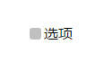
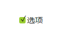
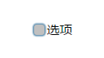
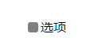
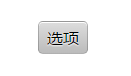
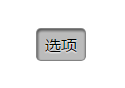

# 第二十七章、自定义复选框
使用label元素的伪元素模仿单选框和复选框的按钮部分，将真正的按钮隐藏。
```css
<input type="checkbox" id="a"/>
<label for="a">选项</label>


input[type="checkbox"] + label:before{
    content: "\a0";
    display: inline-block;
    vertical-align: .2em;
    width: .8em;
    height: .8em;
    margin-right: .2em;
    border-radius: .2em;
    background: silver;
    text-indent: .15em;
    line-height: .35;
}
input[type="checkbox"]{
    width: 0;
    height: 0;
    position: absolute;
}
```
<div align=center></div>  

使用CSS3的新选择器:checked对选中的单选框或复选框设置样式。
```css
input[type="checkbox"]:checked + label:before{
    content: "\2713";
    background: yellowgreen;
}
```
<div align=center></div>  

同理也可以利用:focus和:disabled选择器对聚焦和禁用的选框设置样式
```css
input[type="checkbox"]:focus + label:before{
    box-shadow: 0 0 .1em .1em #58a;
}
input[type="checkbox"]:disabled + label:before{
    box-shadow: none;
    background: gray;
    color: #555;
}
```
<div align=center></div>  

<div align=center></div>  

使用模拟选框的思路还可以用来实现开关类型的按钮，同样将选框隐藏，然后直接将label元素设计成按钮的形式。
```css
input[type="checkbox"] + label{
    display: inline-block;
    padding: .3em .5em;
    background: #ccc;
    background-image: linear-gradient(#ddd,#bbb);
    border: 1px solid rgba(0,0,0,.2);
    border-radius: .3em;
    box-shadow: 0 1px white inset;
    text-align: center;
    text-shadow: 0 1px 1px white;
}
input[type="checkbox"]:checked + label{
    box-shadow: .05em .1em .2em rgba(0,0,0,.6) inset;
    border-color: rgba(0,0,0,.3);
    background: #bbb;
}
```
<div align=center></div>  

<div align=center></div>  
