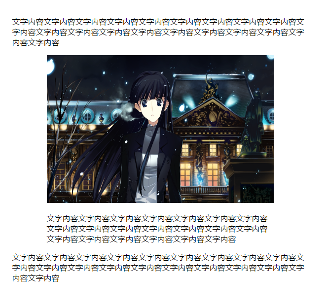

# 第三十章、自适应内部元素
CSS3新增width属性的min-content关键字，这个关键字将解析为整个容器内部最大不可断行元素的宽度（即最宽的单词，图片或具有固定宽度的盒元素）。这个关键字让元素可以基于内容的宽度来决定自身的宽度。
```css
.a{
  width: min-content;
  margin: 0 auto;
}
```
<div align=center></div>  
