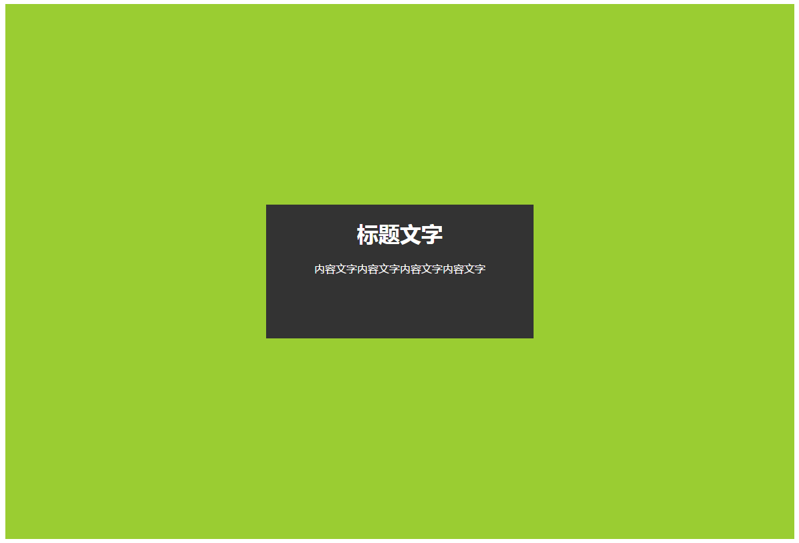
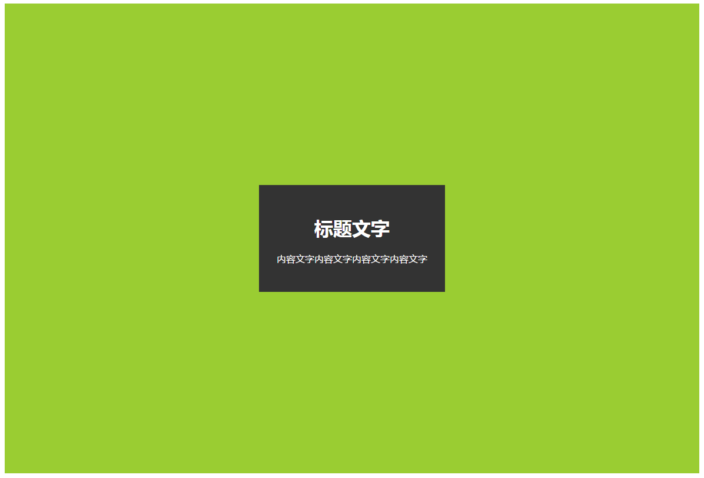
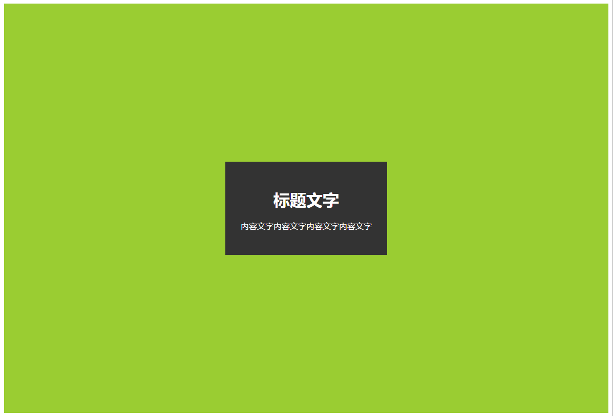
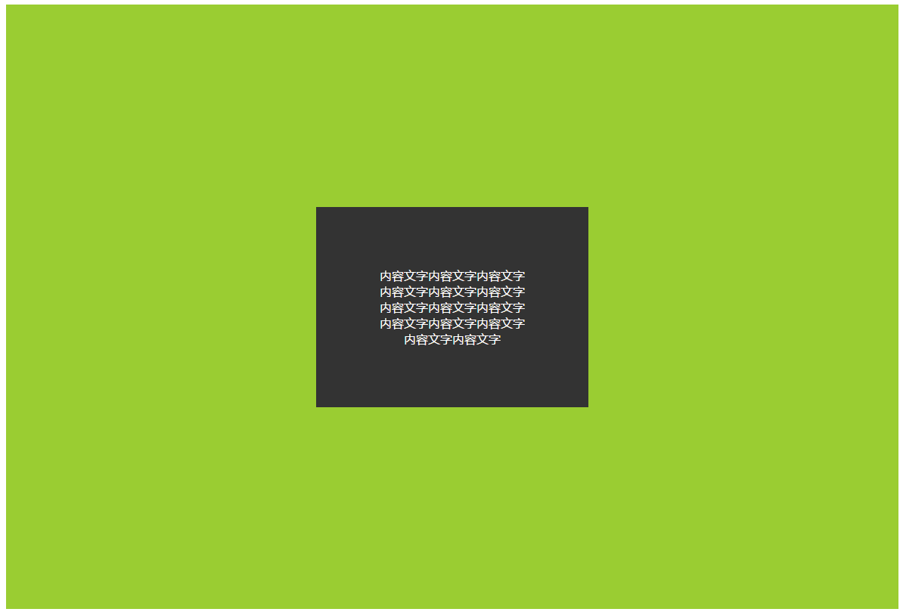

# 第三十三章、垂直居中
## 基于绝对定位
当元素宽高为固定值时，使用绝对定位，将其左上角置于父元素中心，再对其设置反向的负边距（值为元素宽高的一半），让元素的正中心位于父元素的中心。
```css
main{
	position: absolute;
	width: 400px;
	height: 200px;
	left: 50%;
	top: 50%;
	margin-top:-100px;
	margin-left: -200px;
}
```
<div align=center></div>  

上述方法要求元素宽高固定，因为绝大多数按照百分比的属性值都是基于父元素的尺寸进行计算的，使用transform属性中的translate，可以让元素基于自身宽高百分比偏移。
```css
main{
	position: absolute;
	left: 50%;
	top: 50%;
	transform: translate(-50%, -50%);
}
```
<div align=center></div>  

## 基于视口单位
CSS3新增视口单位vw和vh，1vw表示视口宽度的1%，1vh表示视口宽度的1%。当视口宽度小于高度时，1vmin等于1vw，否则等于1vh。当视口宽度小于高度时，1vmax等于1vw，否则等于1vh。即1vmin和1vmax表示vh和vw中的最小值和最大值。
```css
main{
	width: 200px;
	margin: 50vh auto 0;
	transform: translateY(50%);
}
```
这种方法只有在视口中居中时才可以使用

## 基于flexbox
基于弹性盒模型的方案是最佳方案，现在浏览器的支持也已经很高了。对其父元素设置display: flex;，再对元素本身设置margin: auto;，就可以让元素在水平和垂直方向上都居中。
```css
.a{
	display: flex;
}
main{
	margin: auto;
}
```
<div align=center></div>  

flex还可以让元素中没有被标签包裹的文本节点垂直居中
```css
main{
	margin: auto;
	text-align: center;
	display: flex;
	width: 200px;
	align-items: center;
	justify-content: center;
}
```
<div align=center></div>  


