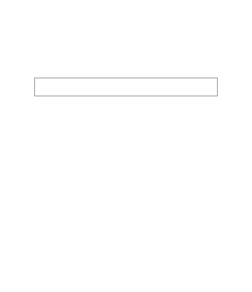
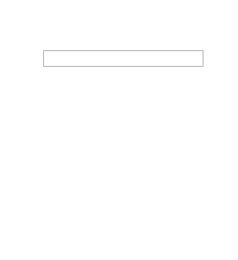

# 第三十五章、缓动效果
动画中的三次贝塞尔曲线可以定义动画的进度，设置相应的值可以使动画突破动画本身的范围
```css
<input type="text">
<div class="tip">提示文字</div>

.tip{
    transform-origin: 1.4em -.4em; // 让元素在左上角位置缩放
    transition: .5s cubic-bezier(.25,.1,.3,1.5);
}
input:not(:focus) + .tip{  // 当输入框没有聚焦时隐藏提示文字
    transform: scale(0);
}
```
<div align=center></div>  

可以看到元素的缩放动画，会使元素超过本身的大小，形成一种回弹的效果，但是在缩放为0的时候，会出现元素再次出现的小BUG，在文本框失去焦点的时候给元素重新定义动画的时间函数可以解决这个问题
```css
input:not(:focus) + .tip{
    transform: scale(0);
    transition: .2s ease;
}
```
<div align=center></div>  


