# Flex布局相关属性
定义display:flex或inline-flex开启子元素的Flex布局。
```css
.container{
  display: flex;

  //行内元素使用
  display: inline-flex;
}
```
设置display: flex后，其子元素的float、clear、vertical-align属性将会失效。
## 容器属性
容器总共有6个属性可以定义。  
第一个：flex-direction，这个属性表示子项目的排列规则，有4个属性值。
```css
.container{
  flex-direction: row; // 默认值，从左至右排列
}
```
<div align=center></div>  

```css
.container{
  flex-direction: row-reverse; // 从右至左排列
}
```
<div align=center>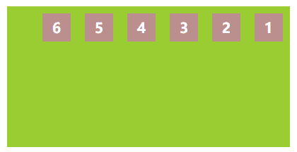</div>  

```css
.container{
  flex-direction: column; // 从上至下排列
}
```
<div align=center>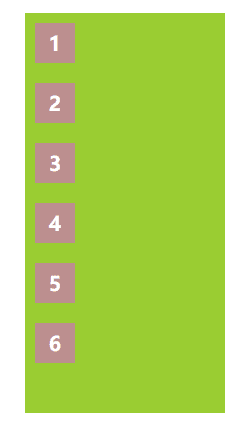</div>  

```css
.container{
  flex-direction: column-reverse; // 从下至上排列
}
```
<div align=center>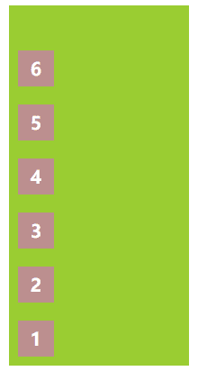</div>  

第二个：flex-wrap，这个属性表示子项目是否换行，有3个属性值。
```css
.container{
  flex-wrap: nowrap; // 默认值，不换行，即使定义了子项目的宽度，也会自动压缩
}
```
<div align=center>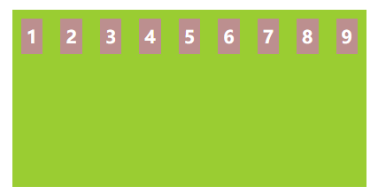</div>  

```css
.container{
  flex-wrap: wrap; // 换行
}
```
<div align=center>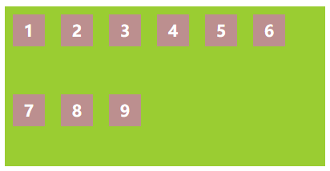</div>  

```css
.container{
  flex-wrap: wrap-reverse; // 换行，且行的排列倒叙
}
```
<div align=center>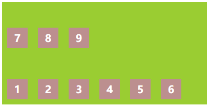</div>  

第三个：flex-flow，这个属性是flex-direction和flex-wrap的简写形式，语法为：
```css
.container{
  flex-flow: (flex-direction) || (flex-wrap);
}
```
第四个：justify-content，这个属性表示子项目的对齐方式，有5个属性值
```css
.container{
  justify-content: flex-start; // 默认值，flex-direction方向相同对齐
}
```
<div align=center>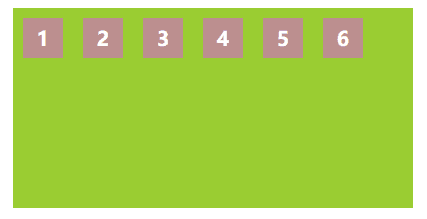</div>  

```css
.container{
  justify-content: flex-end; // flex-direction方向相反对齐
}
```
<div align=center>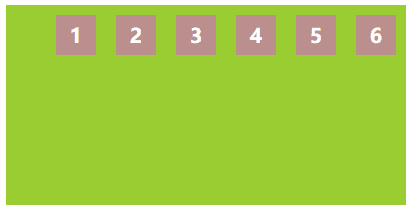</div>  

```css
.container{
  justify-content: center; // flex-direction方向居中对齐
}
```
<div align=center>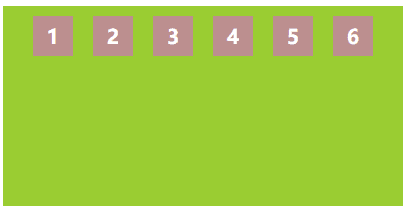</div>  

```css
.container{
  justify-content: space-between // flex-direction方向两端对齐
}
```
<div align=center>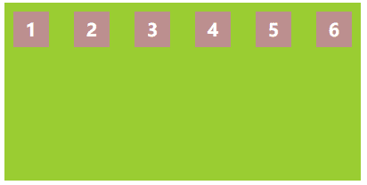</div>  

```css
.container{
  justify-content: space-around; // 每个项目的左右间隔相等对齐，会导致项目之间的距离比项目和边框之间的距离大一倍
}
```
<div align=center>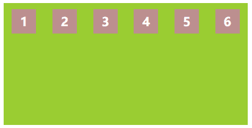</div>  

第五个：align-items，这个属性在当前flex-direction方向的垂直方向上的对齐方式，有5个属性值。
```css
.container{
  align-items: flex-start; // 与当前flex-direction方向的垂线方向同向对齐
}
```
<div align=center></div>  

```css
.container{
  align-items: flex-end // 与当前flex-direction方向的垂线方向反向对齐
}
```
<div align=center>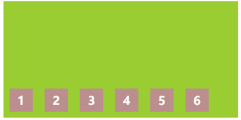</div>  

```css
.container{
  align-items: center; // 与当前flex-direction方向的垂线方向居中对齐
}
```
<div align=center>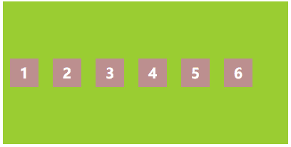</div>  

```css
.container{
  align-items: baseline; // 与子项目的第一行文字的基线对齐
}
```
<div align=center>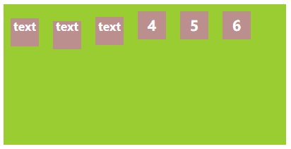</div>  

```css
.container{
  align-items: stretch; // 默认值，当子项目没有设置flex-direction方向上的大小值时，会自动填满容器在flex-direction方向上可用容量
}
```
flex-direction为row时：
<div align=center>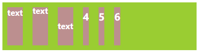</div>  

flex-direction为column时：
<div align=center>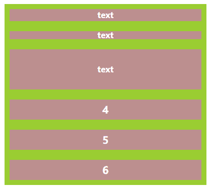</div>  

第六个：align-content，这个属性只在有多个flex-direction方向时有效，即flex-wrap属性为换行时有效，有6个属性值。
```css
.container{
  align-content: flex-start; // 与当前flex-direction方向的垂线方向同向对齐
}
```
<div align=center>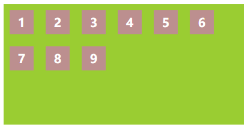</div>  

```css
.container{
  align-content: flex-end; // 与当前flex-direction方向的垂线方向反向对齐
}
```
<div align=center>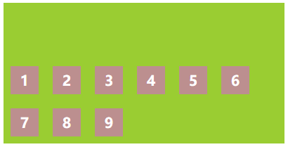</div>  

```css
.container{
  align-content: center; // 与当前flex-direction方向的垂线方向居中对齐
}
```
<div align=center>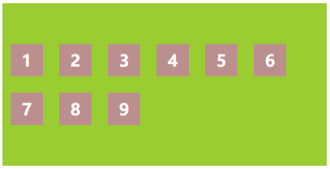</div>  

```css
.container{
  align-content: space-between; // 与当前flex-direction方向的垂线方向两端对齐
}
```
<div align=center>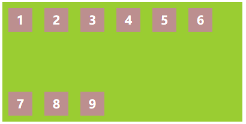</div>  

```css
.container{
  align-content: space-between; // 每个flex-direction方向的垂线方向两端的距离相等，所以flex-direction方向的垂线方向之间的距离为其与边框距离的两倍
}
```
<div align=center>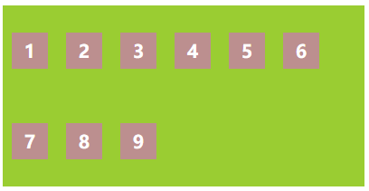</div>  

```css
.container{
  align-content: stretch; // 默认值，所有flex-direction方向会将整个容器均匀填满
}
```
<div align=center>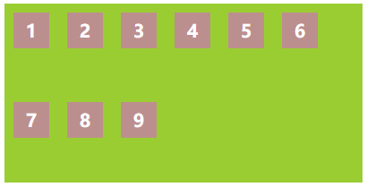</div>  

## 子项目属性
子项目总共有6个属性可以定义。  
第一个：order，表示子项目的排列顺序，数值越小排名越靠前，值为整数，默认值为0，可以取负值。
```css
.item1{
  order: -2;
}
```
<div align=center>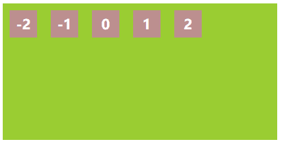</div>  

第二个：flex-grow，表示子项目根据剩余空间的放大比例，默认值为0，即表示即使有剩余空间，也不放大。
```css
.container div{
  flex-grow: 1; // 当所有项目的flex-grow都为1时，它们将平分剩余空间。
}

.container div.item4{
  flex-grow: 2; // 当有一个项目的flex-grow为2时，表示它得到的剩余空间为其他项目的2倍。
}
```
<div align=center>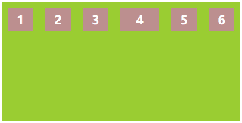</div>  

第三个：flex-shrink，表示子项目根据剩余空间大小的缩小比例，默认值为1，即表示剩余空间不足时，该项目会缩小。不能使用负值。
```css
.container div.item4{
  flex-shrink: 0; // 当某个项目的flex-shrink为0，而其他项目都为1时，表示该项目不会缩小其他项目缩小。
}
```
<div align=center>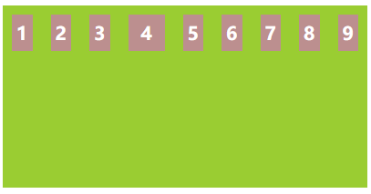</div>  

第四个：flex-basis，表示在分配当前flex-direction方向上的多余空间之前，这个项目要占据多少空间。浏览器会根据这个属性来计算当前flex-direction方向上是否有多余的空间。默认值为auto。即使用项目本身的大小，设置了width(或height，根据flex-direction方向决定)时，会使用width值，没有设置时，会使用项目的内容大小。

flex-basis并不能保证项目的实际大小，当当前flex-direction方向上的剩余空间不足时，项目仍然会被压缩，flex-basis表示的是一种理想的大小，可以看成是项目还未放入容器时应该表现出的大小。最大最小值属性(min-width,max-width,min-height,max-height)仍然可以限制flex-basis的值。

flex-basis指定的值是根据box-sizing的类型来指定的。
```css
// 由于容器剩余大小无法满足给定的值，所有项目会按照其flex-basis的值等比例缩放。
.container div.item1{
  flex-basis: 1000px;
}
.container div.item2{
  flex-basis: 2000px;
}
.container div.item3{
  flex-basis: 3000px;
}
.container div.item4{
  flex-basis: 4000px;
}
```
<div align=center>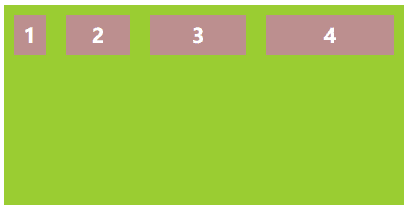</div>  

第五个：flex，这个属性是flex-grow，flex-shrink，flex-basis这3个属性的简写形式，语法为：
```css
.item{
  flex: (flex-grow) || (flex-shrink) || (flex-basis);
}
```
该属性的默认值是flex: 0 1 auto，有两个关键字值，none和auto。
```css
.item{
  flex: none; // 表示 flex: 0 0 auto，即表示不放大，不缩放
}
.item{
  flex: auto; // 表示 flex: 1 1 auto，即表示放大，缩放
}
```
flex还有以下特殊情况：
```css
flex: 0; // 值为0时，表示flex: 0 1 0，即直接以内容宽度显示。
flex: 0% // 值为一个百分值时，表示flex-basis的值，此时flex-grow值为1，flex-shrink值为1，表示flex: 1 1 0%，即放大，缩放。
flex: 1px // 值为一个带单位的大小值时，与百分值相同。
flex: 1; // 值为一个大于0的数字时，表示flex-grow的值，此时flex-shrink值为1，flex-basis值为0%，即flex: 1 1 0%，即放大，缩放。
flex: 1 2; // 值为两个大于0的数字时，表示flex-grow和flex-shrink的值，此时flex-basis值为0%，即flex: 1 2 0%，即放大，缩放。
flex: 1 0; // 值为大于0的数字和0时，表示flex: 1 1 0，即放大，缩放。
flex: 0 1; // 值为0和大于0的数字时，表示flex: 0 1 0，即直接以内容宽度显示。
flex: 0 30px; // 值为非负数字(0和正数)和一个带单位的大小值时(无论先后顺序)，表示flex-grow和flex-basis的值，表示flex: 0 1 30px
```
第六个：align-self，该属性表示单个项目的对齐方式，属性值与容器元素的align-item完全相同，默认值为auto，与父元素表现一致。

flex各个属性中具有方向性的属性都依赖flex-direction的方向和flex-direction方向的数量(flex-wrap换行会产生多个相同的flex-direction方向)，时刻要注意当前flex-direction的方向。


